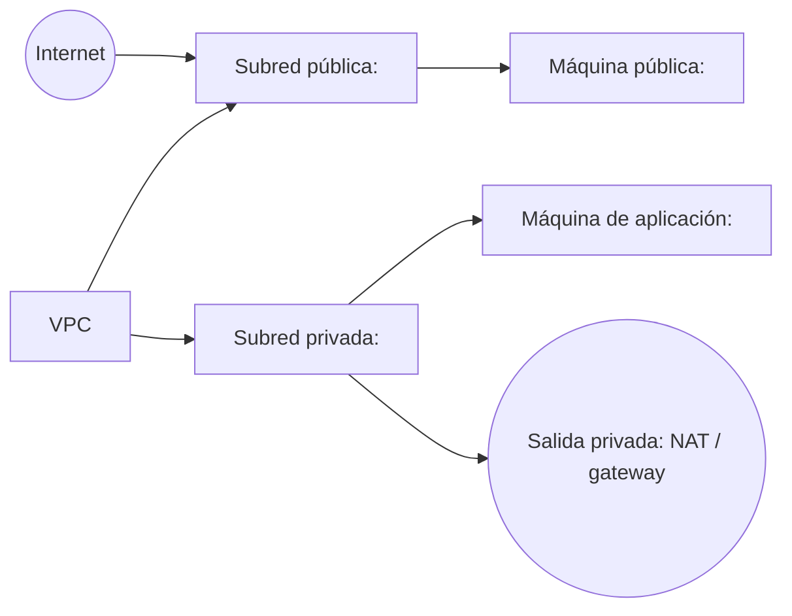
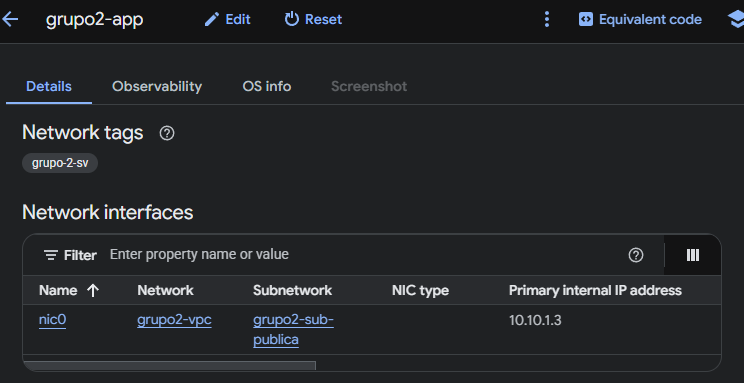

# Práctica 3 — Red

| Dato | Información |
|---|---|
| **Equipo** | 2 |
| **Proyecto** | `project-56eb9056-3ab4-4adb-b64` |

## 1. Diagrama de infraestructura

> **Pendiente:** insertar aquí un diagrama Mermaid que muestre la VPC, las dos subredes con sus rangos CIDR, las dos máquinas, la entrada del tráfico público y la salida del tráfico privado.



## 2. Evidencias por fase

> Añadir una evidencia verificable bajo cada título: captura, enlace o referencia al recurso correspondiente.

### Fase 0 — [nombre de la fase]


### Fase 1 — [nombre de la fase]


### Fase 2 — [nombre de la fase]


### Fase 3 — [nombre de la fase]




### Fase 4 — [nombre de la fase]


### Fase 5 — [nombre de la fase]

> **Pendiente:** incluir la evidencia de la fase 5.

### Fase 6 — [nombre de la fase]

> **Pendiente:** incluir la evidencia de la fase 6.

## 3. Comandos ejecutados

> **Pendiente:** copiar aquí, como texto, todos los comandos utilizados durante la práctica. No insertar capturas de pantalla. Indicar, si es necesario, en qué fase se ejecutó cada comando.

```bash
# Pegar aquí los comandos ejecutados.
```

## 4. Decisiones libres

> **Pendiente:** completar exactamente cuatro decisiones. Escribir una línea por decisión e incluir su justificación.

1. **Decisión:** `<describir la decisión>` — **Justificación:** `<explicar por qué se tomó>`.
2. **Decisión:** `<describir la decisión>` — **Justificación:** `<explicar por qué se tomó>`.
3. **Decisión:** `<describir la decisión>` — **Justificación:** `<explicar por qué se tomó>`.
4. **Decisión:** `<describir la decisión>` — **Justificación:** `<explicar por qué se tomó>`.

## 5. Preguntas de análisis

### 5.1 Etiqueta de red de la máquina de aplicación

> **Pendiente:** responder en un párrafo qué deja de funcionar exactamente al quitar la etiqueta de red y aplicar los cambios, y explicar por qué la regla de cortafuegos continúa existiendo.

### 5.2 Plan de la fase 2 sin cambios

> **Pendiente:** responder en un párrafo por qué el plan no propuso cambios aunque el código era distinto y qué modificación habría sido necesaria para provocar la recreación de un recurso.

### 5.3 Coste mensual estimado

> **Pendiente:** calcular el coste de un mes con la red completa encendida. Desglosar el importe por recurso, indicar la moneda y señalar cuál es el coste más sorprendente.
